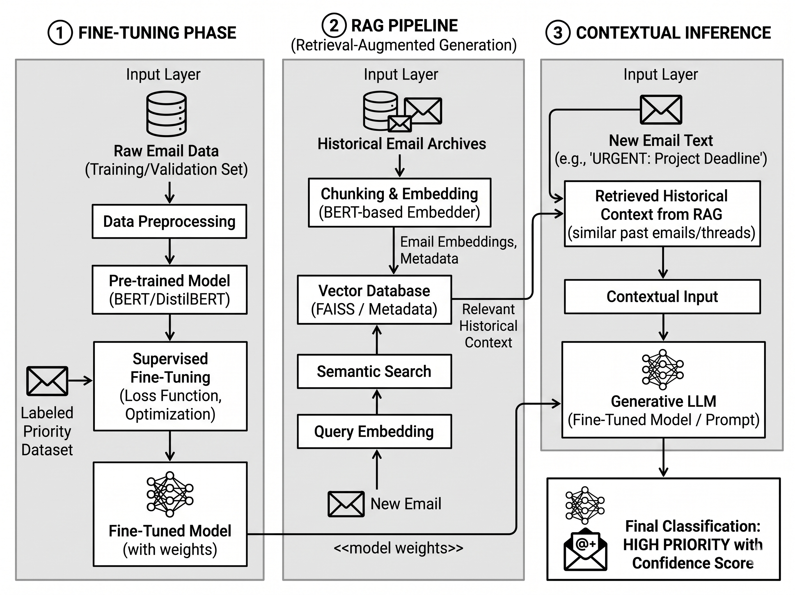

# Smart Email Prioritization (SME)

An end-to-end Email Priority Classification System using a 3-phase architecture:
**DistilBERT Fine-Tuning → FAISS RAG Pipeline → Flan-T5 Contextual Inference**

## Architecture



### Phase 1: Fine-Tuning
- Pre-trained DistilBERT fine-tuned on the Enron email dataset with rule-based priority labels
- 3-class classification: **High**, **Medium**, **Low**

### Phase 2: RAG Pipeline
- Historical emails embedded using `all-MiniLM-L6-v2` (sentence-transformers)
- Stored in a FAISS vector index for fast semantic similarity search
- New emails are embedded and matched against historical context

### Phase 3: Contextual Inference
- Fine-tuned model prediction + RAG context fed to `google/flan-t5-base`
- LLM produces final classification with confidence score and reasoning

## Project Structure

```
SME/
├── config/settings.py           # Central configuration
├── preprocessing/
│   ├── cleaner.py               # Email text cleaning
│   └── data_loader.py           # Enron dataset loader
├── fine_tuning/
│   ├── label_generator.py       # Rule-based label assignment
│   ├── dataset.py               # PyTorch Dataset
│   ├── trainer.py               # DistilBERT fine-tuning
│   └── evaluator.py             # Classification metrics
├── rag/
│   ├── embedder.py              # BERT-based embedding
│   ├── vector_store.py          # FAISS index management
│   └── retriever.py             # Semantic search
├── inference/
│   ├── llm_prompt.py            # Prompt templates
│   └── contextual_classifier.py # Full 3-phase classifier
├── pipeline.py                  # CLI orchestrator
├── app.py                       # Streamlit demo UI
└── requirements.txt
```

## Quick Start

```bash
# 1. Install dependencies
pip install -r requirements.txt

# 2. Preprocess Enron dataset
python pipeline.py preprocess

# 3. Fine-tune DistilBERT
python pipeline.py train

# 4. Build FAISS index
python pipeline.py index

# 5. Classify an email
python pipeline.py classify --email "URGENT: Budget approval needed ASAP"

# 6. Launch Streamlit UI
streamlit run app.py
```

## Commands

| Command | Description |
|---------|-------------|
| `python pipeline.py preprocess` | Download & clean Enron emails |
| `python pipeline.py train` | Generate labels + fine-tune model |
| `python pipeline.py index` | Build FAISS vector index |
| `python pipeline.py classify --email "..."` | Classify a single email |
| `python pipeline.py evaluate` | Run evaluation metrics |
| `python pipeline.py demo` | Interactive CLI demo |
| `streamlit run app.py` | Launch web UI |

## Tech Stack

- **PyTorch** + **HuggingFace Transformers**
- **DistilBERT** (classification) + **all-MiniLM-L6-v2** (embeddings) + **Flan-T5** (reasoning)
- **FAISS** (vector search)
- **Streamlit** (demo UI)
- **scikit-learn** (evaluation metrics)
